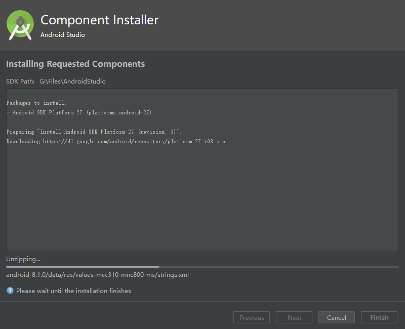
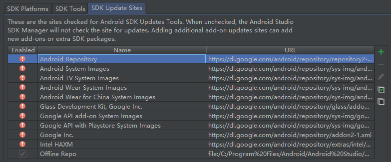

# 常见配置问题

## Android Studio问题

#### 缺少依赖库问题

上手安卓最常遇见的问题之一，错误如下图所示，此时点击超链接即可自动跳转到安装页面


安装之后重新运行即可。




#### 连接不上Android Repository

这也是最常见的问题之一，当你发现自己无法下载部分依赖的时候，请优先考虑这种情况。进入 `File` -> `Settings` -> `Appearance & Behavior` -> `System Settings` -> `Android SDK` -> `SDK Update Sites` 列表，可以看到此时的 `Android Repository` 无法连接。



解决方法如下：

1. 进入 `C:\windows\system32\drivers\etc\` 
2. 打开 `hosts` 文件
3. 添加 `203.208.41.32 dl.google.com` 即可解决

#### 安卓包配置问题

一般格式为

```
Could not HEAD **
Could not Get **
```

如：`Android Studio Could not GET gradle-3.2.0.pom`

这一类问题是由于无法连接到 Maven 库造成的，解决方法如下：

1. 进入`当前所在项目名/android`

2. 打开 `build.gradle` 

3. 找到下面这一部分，并加上 `maven { url 'http://maven.aliyun.com/nexus/content/groups/public/' }` 
  ```
  allprojects {
      repositories {
        google()
        jcenter()
        maven { url 'http://maven.aliyun.com/nexus/content/groups/public/' } //添加这一句
  	}
  }
  ```

4. 进入 `File/ Settings/ Build, Execution, Deployment/ Gradle/ Android Studio ` 中，勾选上 `Enable embedded Maven repository` ，重启 Android Studio 即可解决。

   > **注意：**存在这样的一种情况，当你根据上述步骤设置了之后，依旧无法解决这个问题，并有类似于 `Could not HEAD maven.aliyun.com` 的报错信息，请检查 `C:\Users\{user_name}\.gradle\gradle.properties` 是否有设置代理。删除后问题即可解决。

