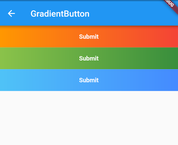

# 通过组合现有Widget实现自定义Widget

在Flutter中页面UI通常都是由一些低阶别的Widget组合而成，当我们需要封装一些通用Widget时，应该首先考虑是否可以通过组合其它Widget来实现，如果可以则应优先使用组合，因为直接通过现有Widget拼装会非常方便、简单、高效。

### 示例：自定义渐变按钮

Flutter Widget库中的按钮默认不支持渐变背景，为了实现渐变背景按钮，我们自定义一个GradientButton Widget。我们先来看看效果：



我们看看GradientButton实现：

```dart
import 'package:flutter/material.dart';

class GradientButton extends StatelessWidget {
  GradientButton({
    this.colors,
    this.width,
    this.height,
    this.onTap,
    @required this.child,
  });

  // 渐变色数组
  final List<Color> colors;

  // 按钮宽高
  final double width;
  final double height;

  final Widget child;

  //点击回调
  final GestureTapCallback onTap;

  @override
  Widget build(BuildContext context) {
    ThemeData theme = Theme.of(context);

    //确保colors数组不空
    List<Color> _colors = colors ??
        [theme.primaryColor, theme.primaryColorDark ?? theme.primaryColor];

    return DecoratedBox(
      decoration: BoxDecoration(
        gradient: LinearGradient(colors: _colors),
      ),
      child: Material(
        type: MaterialType.transparency,
        child: InkWell(
          splashColor: colors.last,
          highlightColor: Colors.transparent,
          onTap: onTap,
          child: ConstrainedBox(
            constraints: BoxConstraints.tightFor(height: height, width: width),
            child: Center(
              child: Padding(
                padding: const EdgeInsets.all(8.0),
                child: DefaultTextStyle(
                    style: TextStyle(fontWeight: FontWeight.bold),
                    child: child),
              ),
            ),
          ),
        ),
      ),
    );
  }
}
```

可以看到GradientButton是由Padding、Center、InkWell等Widget组合而成。当然上面的代码只是一个示例，作为一个按钮它还并不完整，比如没有禁用状态、不能定义圆角等，读者可以根据实际需要来完善。

#### 使用GradientButton

```dart
class GradientButtonRoute extends StatelessWidget {
  @override
  Widget build(BuildContext context) {
    return Container(
      child: Column(
        children: <Widget>[
          GradientButton(
            colors: [Colors.orange,Colors.red],
            height: 50.0,
            child: Text("Submit"),
            onTap:onTap ,
          ),
          GradientButton(
            height: 50.0,
            colors: [Colors.lightGreen, Colors.green[700]],
            child: Text("Submit"),
            onTap: onTap,
          ),
          GradientButton(
            height: 50.0,
            colors: [Colors.lightBlue[300], Colors.blueAccent],
            child: Text("Submit"),
            onTap: onTap,
          ),
        ],
      ),
    );
  }

  onTap(){
    print("button click");
  }
}
```

### 总结

通过组合的方式定义Widget和我们之前写界面并无差异，不过在抽离出单独的Widget时我们要考虑代码规范性，如必要参数要用`@required` 标注，对于可选参数在特定场景需要判空或设置默认值等。这是由于使用者大多时候可能不了解Widget的内部细节，所以为了保证代码健壮性，我们需要在用户错误地使用Widget时能够兼容或报错提示（使用assert断言函数）。
