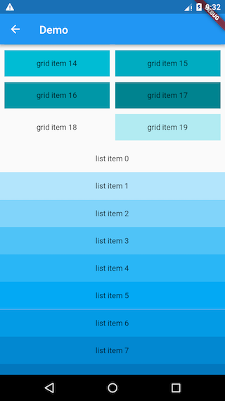

## CustomScrollView

CustomScrollView可以使用sliver自定义滚动模型（效果）的widget。它可以包含多种滚动滚动模型，举个例子，假设有一个页面，顶部需要一个GridView，底部需要一个ListView，而要求整个页面的滑动效果是统一一致的，即它们看起来是一个整体，如果使用GridView+ListView来实现的话，就不能保证一致的滑动效果，因为它们的滚动效果是分离，所以这时就需要一个"胶水"，把这些彼此独立的可滚动widget（Sliver）"粘"起来，而CustomScrollView的功能就相当于“胶水”。

### Sliver

Sliver有细片、小片之意，在Flutter中，Sliver通常指具有特定滚动效果的可滚动块。可滚动widget，如ListView、GridView等都有对应的Sliver实现如SliverList、SliverGrid等。对于大多数Sliver来说，它们和可滚动Widget最主要的区别是**Sliver不会包含Scrollable Widget，也就是说Sliver本身不包含滚动交互模型** ，正因如此，CustomScrollView才可以将多个Sliver"粘"在一起，这些Sliver共用CustomScrollView的Scrollable，最终实现统一的滑动效果。

> Sliver系列Widget比较多，我们不会一一介绍，读者只需记住它的特点，需要时再去查看文档即可。上面之所以说“大多数“Sliver都和可滚动Widget对应，是由于还有一些如SliverPadding、SliverAppBar等是和可滚动Widget无关的，它们主要是为了结合CustomScrollView一起使用，这是因为**CustomScrollView的子widget必须都是Sliver**。

### 示例

```dart
import 'package:flutter/material.dart';

class CustomScrollViewTestRoute extends StatelessWidget {
  @override
  Widget build(BuildContext context) {
    //因为本路由没有使用Scaffold，为了让子级Widget(如Text)使用
    //Material Design 默认的样式风格,我们使用Material作为本路由的根。
    return Material(
      child: CustomScrollView(
        slivers: <Widget>[
          //AppBar，包含一个导航栏
          SliverAppBar(
            pinned: true,
            expandedHeight: 250.0,
            flexibleSpace: FlexibleSpaceBar(
              title: const Text('Demo'),
              background: Image.asset(
                "./images/avatar.png", fit: BoxFit.cover,),
            ),
          ),

          SliverPadding(
            padding: const EdgeInsets.all(8.0),
            sliver: new SliverGrid( //Grid
              gridDelegate: new SliverGridDelegateWithFixedCrossAxisCount(
                crossAxisCount: 2, //Grid按两列显示
                mainAxisSpacing: 10.0,
                crossAxisSpacing: 10.0,
                childAspectRatio: 4.0,
              ),
              delegate: new SliverChildBuilderDelegate(
                    (BuildContext context, int index) {
                  //创建子widget      
                  return new Container(
                    alignment: Alignment.center,
                    color: Colors.cyan[100 * (index % 9)],
                    child: new Text('grid item $index'),
                  );
                },
                childCount: 20,
              ),
            ),
          ),
          //List
          new SliverFixedExtentList(
            itemExtent: 50.0,
            delegate: new SliverChildBuilderDelegate(
                    (BuildContext context, int index) {
                  //创建列表项      
                  return new Container(
                    alignment: Alignment.center,
                    color: Colors.lightBlue[100 * (index % 9)],
                    child: new Text('list item $index'),
                  );
                },
                childCount: 50 //50个列表项
            ),
          ),
        ],
      ),
    );
  }
}
```


代码分为三部分：

- 头部SliverAppBar：SliverAppBar对应AppBar，两者不同之处在于SliverAppBar可以集成到CustomScrollView。SliverAppBar可以结合FlexibleSpaceBar实现Material Design中头部伸缩的模型，具体效果，读者可以运行该示例查看。
- 中间的SliverGrid：它用SliverPadding包裹以给SliverGrid添加补白。SliverGrid是一个两列，宽高比为4的网格，它有20个子widget。
- 底部SliverFixedExtentList：它是一个所有子元素高度都为50像素的列表。

运行效果：



