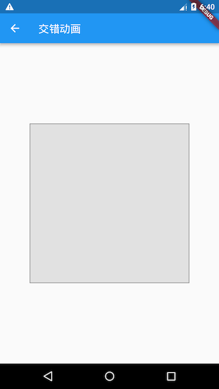

## 交错动画

有些时候我们可能会需要一些负杂的动画，这些动画可能需要一个动画序列或重叠的动画组成，比如：有一个柱状图，需要在高度增长的同改变颜色，等到增长到最大高度后，我们需要在X轴上平移一段距离。这时我们就需要使用交错动画（Stagger Animation）。交错动画需要注意以下几点：

1. 要创建交错动画，需要使用多个动画对象
2. 一个AnimationController控制所有动画
3. 给每一个动画对象指定间隔（Interval）

所有动画都由同一个[AnimationController](https://docs.flutter.io/flutter/animation/AnimationController-class.html)驱动，无论动画实时持续多长时间，控制器的值必须介于0.0和1.0之间，而每个动画的间隔（Interval）介于0.0和1.0之间。对于在间隔中设置动画的每个属性，请创建一个[Tween](https://docs.flutter.io/flutter/animation/Tween-class.html)。 Tween指定该属性的开始值和结束值。也就是说0.0到1.0代表整个动画过程，我们可以给不同动画指定起始点和终止点来决定它们的开始时间和终止时间。

#### 示例

下面我们看一个例子，实现一个柱状图增长的动画：

1. 开始时高度从0增长到300像素，同时颜色由绿色渐变为红色；这个过程占据整个动画时间的60%。
2. 高度增长到300后，开始沿X轴向右平移100像素；这个过程占用整个动画时间的40%。

我们将执行动画的Widget分离出来：

```dart
class StaggerAnimation extends StatelessWidget {
  StaggerAnimation({ Key key, this.controller }): super(key: key){
    //高度动画
    height = Tween<double>(
      begin:.0 ,
      end: 300.0,
    ).animate(
      CurvedAnimation(
        parent: controller,
        curve: Interval(
          0.0, 0.6, //间隔，前60%的动画时间
          curve: Curves.ease,
        ),
      ),
    );

    color = ColorTween(
      begin:Colors.green ,
      end:Colors.red,
    ).animate(
      CurvedAnimation(
        parent: controller,
        curve: Interval(
          0.0, 0.6,//间隔，前60%的动画时间
          curve: Curves.ease,
        ),
      ),
    );

    padding = Tween<EdgeInsets>(
      begin:EdgeInsets.only(left: .0),
      end:EdgeInsets.only(left: 100.0),
    ).animate(
      CurvedAnimation(
        parent: controller,
        curve: Interval(
          0.6, 1.0, //间隔，后40%的动画时间
          curve: Curves.ease,
        ),
      ),
    );
  }


  final Animation<double> controller;
  Animation<double> height;
  Animation<EdgeInsets> padding;
  Animation<Color> color;

  Widget _buildAnimation(BuildContext context, Widget child) {
    return Container(
      alignment: Alignment.bottomCenter,
      padding:padding.value ,
      child: Container(
        color: color.value,
        width: 50.0,
        height: height.value,
      ),
    );
  }

  @override
  Widget build(BuildContext context) {
    return AnimatedBuilder(
      builder: _buildAnimation,
      animation: controller,
    );
  }
}
```

StaggerAnimation中定义了三个动画，分别是对Container的height、color、padding属性设置的动画，然后通过Interval来为每个动画指定在整个动画过程的起始点和终点。

下面我们来实现启动动画的路由：

```dart
class StaggerDemo extends StatefulWidget {
  @override
  _StaggerDemoState createState() => _StaggerDemoState();
}

class _StaggerDemoState extends State<StaggerDemo> with TickerProviderStateMixin {
  AnimationController _controller;

  @override
  void initState() {
    super.initState();

    _controller = AnimationController(
        duration: const Duration(milliseconds: 2000),
        vsync: this
    );
  }


  Future<Null> _playAnimation() async {
    try {
      //先正向执行动画
      await _controller.forward().orCancel;
      //再反向执行动画
      await _controller.reverse().orCancel;
    } on TickerCanceled {
      // the animation got canceled, probably because we were disposed
    }
  }

  @override
  Widget build(BuildContext context) {
    return  GestureDetector(
      behavior: HitTestBehavior.opaque,
      onTap: () {
        _playAnimation();
      },
      child: Center(
        child: Container(
          width: 300.0,
          height: 300.0,
          decoration: BoxDecoration(
            color: Colors.black.withOpacity(0.1),
            border: Border.all(
              color:  Colors.black.withOpacity(0.5),
            ),
          ),
          //调用我们定义的交错动画Widget
          child: StaggerAnimation(
              controller: _controller
          ),
        ),
      ),
    );
  }
}
```
执行效果如下，点击灰色矩形，就可以看到整个动画效果：


